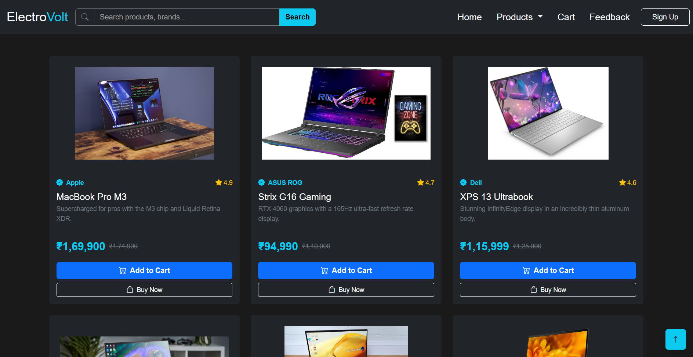

# ⚡ ElectroVolt

A responsive electronics e-commerce website UI built using Bootstrap 5.3.8.

This project focuses on using Bootstrap components and grid system to create a clean and modern shopping interface.

## 🚀 Features

- Fully responsive layout using Bootstrap 5.3.8
- Product cards and grid-based design
- Navbar and footer sections
- Carousel / banner section (if included)
- Mobile-friendly UI
- Clean and structured layout

## 🛠️ Tech Stack

- HTML5
- Bootstrap 5.3.8
- CSS3
- JavaScript (optional / minimal)

## 📸 Preview

Add screenshot here:

## 🎯 Purpose of Project

This project was created to practice:

- Bootstrap grid system
- Prebuilt components (cards, navbar, carousel)
- Responsive design principles
- Building real-world UI layouts faster using frameworks

## ⚠️ Disclaimer

This project is for learning purposes.  
UI inspiration is taken from modern e-commerce platforms.

## 👨‍💻 Author

Mohit  
GitHub: https://github.com/Mohit-3312
